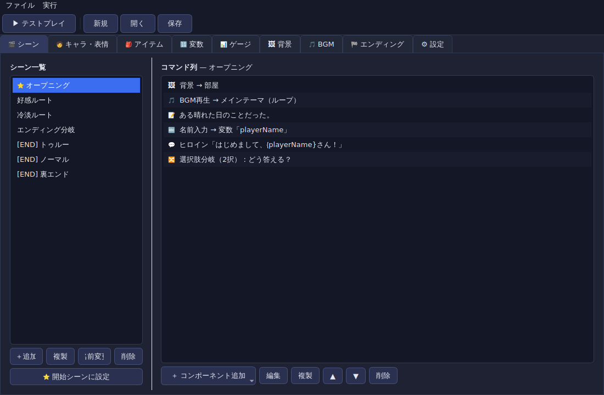

# 📖 ノベルメーカー (NovelMaker)

ノベルゲーム特化の **ノーコード** デスクトップ制作ソフト（Python + PySide6）。
プログラミング不要で、コンポーネントを並べるだけでノベルゲームを作成し、
その場でテストプレイできる **エディタ＋プレイヤー一体型** アプリです。



## ✨ 対応機能

| 機能 | 説明 |
|------|------|
| 🧩 ノーコード編集 | シーンにコンポーネント（コマンド）を並べて物語を作成 |
| 🔢 変数管理 | 数値 / 文字列 / 真偽の変数を作成・操作。セリフに `{変数名}` で埋め込み |
| 🔀 分岐 | 選択肢分岐 / 条件分岐（AND・OR の条件式ビルダー付き） |
| 🔤 名前入力 | プレイヤーに名前などを入力させ、文字列変数に格納 |
| 🎵 BGMループ | BGM の再生 / 停止。ループ再生に対応 |
| 🧑 キャラ・表情差分 | キャラごとに複数の表情（立ち絵）を登録・切り替え |
| 🎒 アイテム管理 | 入手 / 使用(消費) / 破棄。絵文字＋PNG画像アイコン、入手演出（アイコン＋説明） |
| 💬 セリフ管理 | 話者・表情・本文を指定したセリフ、地の文（ナレーション） |
| 🏁 エンディング管理 | 通常エンド + **裏エンド（隠し要素）** に対応 |
| 💾 マニュアルセーブ | **10スロット** の手動セーブ / ロード |
| 🌑 暗転・背景管理 | 背景の切り替え、暗転 / 暗転解除 |
| 📊 数値ゲージ管理 | 好感度などのゲージ（最小/最大/色/表示）を画面に表示 |
| 🌐 ブラウザ書き出し | 作ったゲームを単体HTML/JSに書き出し、ブラウザで配布・プレイ |
| 💿 アプリ配布 | 本体を Mac universal DMG / Windows EXE に書き出し（CI対応） |
| 👤 主人公の立ち絵 | プレイヤー操作キャラは立ち絵を既定で非表示（名前のみ）。設定で表示可 |
| 🎨 レイアウト編集 | セリフ枠・立ち絵・選択肢・ゲージ等の表示位置をドラッグで自由配置 |
| 🖼 コンポーネント画像 | セリフ枠・ボタン等の背景に画像を取り込んでカスタム |
| 🗺 フローチャート | シーンと分岐（選択肢/条件/移動/エンディング）を図で可視化 |
| 🔊 効果音(SE) | BGMとは別系統で効果音を一度だけ再生 |
| 🌅 CG | イベント絵（CG）を画面全体に表示／非表示 |
| 🚪 キャラ退場 | 表示中（または指定）のキャラの立ち絵を画面から消す |
| ▶ 選択シーンからテスト | シーン一覧で選んだシーンから即テストプレイ |

## 🚀 セットアップ & 起動

```bash
# 依存をインストール
pip install -r requirements.txt

# 起動
python run.py
```

> Linux のヘッドレス/最小環境では Qt 実行に追加ライブラリが必要な場合があります:
> `libegl1 libgl1 libxkbcommon0 libdbus-1-3 libxcb-cursor0` など。
> 日本語表示には `fonts-noto-cjk` の導入を推奨します。

## 🎮 使い方

1. **シーン** タブで物語の場面（シーン）を作る。
2. シーンに「＋ コンポーネント追加」でセリフ・背景・分岐などを並べる。
3. **キャラ・表情 / アイテム / 変数 / ゲージ / 背景 / BGM / エンディング** タブで
   素材を登録する。
4. ツールバーの **▶ テストプレイ**（F5）でその場でプレイ。
5. **ファイル → 保存** でプロジェクト（`.nvproj`）として保存。

### コンポーネント（コマンド）一覧

| アイコン | コマンド | 役割 |
|---|---|---|
| 💬 | セリフ | キャラ・表情を指定して台詞を表示 |
| 📝 | 地の文 | ナレーションを表示 |
| 🖼 | 背景変更 | 背景を切り替え |
| 🚪 | キャラ退場 | 表示中（または指定）のキャラの立ち絵を消す |
| 🌅 | CG表示 | イベント絵を画面全体に表示 / 消す |
| 🌑 | 暗転 | 画面を暗転 / 解除 |
| 🎵 | BGM | BGM の再生 / 停止（ループ・フェードイン/アウト可） |
| 🔊 | 効果音(SE) | 効果音を一度だけ再生 |
| 🎞 | エンドロール | セリフ枠が消え、縦スクロールでスタッフロールを流す（クリックでスキップ） |
| 🔤 | 名前入力 | 入力値を文字列変数へ格納 |
| 🔢 | 変数操作 | 代入 / 加算 / 減算 / 乗算 / 反転 |
| 📊 | ゲージ操作 | ゲージの代入 / 加減（min/max でクランプ） |
| 🎒 | アイテム | 入手 / 使用(消費) / 破棄（入手・使用時にアイコン＋説明を表示） |
| 🔀 | 選択肢分岐 | 選択肢ごとに移動先と出現条件を設定 |
| ❓ | 条件分岐 | 条件成立 / 不成立で別シーンへジャンプ |
| ➡ | シーン移動 | 指定シーンへジャンプ |
| 🏁 | エンディング | エンディング（裏エンド含む）を表示 |

## 🏠 タイトル画面（はじめから / つづきから）

ゲーム開始時に **タイトル画面** が表示されます。

- **はじめから** … 最初からプレイ
- **つづきから** … セーブデータがあれば、ロード画面を開いて再開
- プレイ中メニューの **タイトル**／エンディングの **タイトルへ戻る** でいつでも復帰

タイトルの **背景・BGM** は **設定** タブの「タイトル画面の背景／BGM」で指定できます。
（この画面はデスクトップ版・ブラウザ書き出し版の両方に反映されます）

## 👤 主人公（プレイヤー操作キャラ）の立ち絵

**キャラ・表情** タブでキャラを「主人公（プレイヤー操作キャラ）」に設定すると、
そのキャラのセリフでは **立ち絵を表示しません**（名前だけ表示）。
立ち絵を出したい場合は「立ち絵を表示する」をオンにします。
主人公が話している間も、直前に表示していた相手の立ち絵は維持されます。

セリフの表情選択には **「（立ち絵表示なし）」** が既定で用意されており、
任意のキャラのセリフを立ち絵なし（名前だけ）で表示できます。
新規セリフは既定で「立ち絵表示なし」です。

## 🎨 レイアウト編集（表示位置・コンポーネント画像）

**レイアウト** タブで、各コンポーネントの **表示位置をドラッグで自由に変更** できます。

- 対象：セリフ枠 / 立ち絵 / 選択肢 / ゲージ / アイテムボタン / メニュー
- 位置は画面サイズに対する割合で保存され、どの画面サイズでも崩れません
- 「位置を初期化」で既定配置に戻せます

同じタブで **コンポーネントの画像取り込み** もできます。

- セリフ枠の背景 / 選択肢ボタンの背景 / タイトルボタンの背景 / アイテムボタンの画像
- 取り込んだ画像は引き伸ばして表示され、プレイ画面・ブラウザ書き出しの両方に反映

## 🗺 フローチャートで分岐を見る

**フローチャート** タブで、シーンと分岐の流れを図として確認できます。

- ノード＝シーン（青＝開始シーン、橙＝エンディング/🔒裏エンド）
- エッジ＝選択肢 / 条件分岐(真・偽) / シーン移動 / エンディング（ラベル付き）
- ノードをドラッグで整理、**ダブルクリックでそのシーンを編集**、ズーム/全体表示に対応

## 🌐 ゲームをブラウザに書き出す

メニューの **ファイル → 🌐 ブラウザ(HTML)に書き出し…** で、作成したゲームを
単体の Web ページとして書き出せます。出力フォルダ内の **`index.html`** を
ブラウザで開けば、そのまま遊べます（インストール不要・配布も簡単）。

- 画像・BGM などのアセットは `assets/` に自動コピーされ、パスも相対化されます。
- セーブ（10スロット）はブラウザの `localStorage` に保存されます。
- 静的ファイルのみなので、GitHub Pages / Netlify 等にそのまま公開できます。

### ☁ Cloudflare Pages にそのままデプロイ（ZIP書き出し）

**ファイル → ☁ Cloudflare用ZIPに書き出し…** で、ZIP を生成します。
ZIP の **ルート直下に `index.html`** が入っているため、そのまま公開できます。

1. Cloudflare ダッシュボード → **Workers & Pages** → **Create** → **Pages**
2. **Upload assets（直接アップロード）** を選択
3. 生成した ZIP（または展開した中身）をドラッグ＆ドロップ
4. **Deploy** で公開URLが発行されます

アセットには長期キャッシュ用の `_headers` も同梱されます。

書き出される内容:

```
出力フォルダ/
├── index.html      # これを開けば起動
├── game.js         # ゲームデータ（プロジェクト）
├── engine.js       # 実行エンジン（runtime.py のJS版）
├── player.js       # プレイヤーUI
├── style.css
└── assets/         # 画像・音声
```

## 💿 本体を Mac DMG / Windows EXE に書き出す

ノベルメーカー本体を各OSの実行ファイルにパッケージできます。
詳しくは [`packaging/README.md`](packaging/README.md) を参照。

- **Mac:** `NovelMaker.app` →  **universal2 DMG**（Intel + Apple Silicon 両対応）
- **Windows:** `NovelMaker.exe`（ワンフォルダ / zip）

GitHub Actions（`.github/workflows/build.yml`）で、macOS / Windows / Linux 向けを
自動ビルドします。`v*` タグを push すると Release に成果物を添付します。

```bash
pip install -r requirements.txt pyinstaller
pyinstaller --noconfirm packaging/novelmaker.spec
```

## 🗂 プロジェクト構成

```
game-maker/
├── run.py                  # 起動ランチャー
├── requirements.txt
├── novelmaker/             # デスクトップアプリ本体（PySide6）
│   ├── app.py              # QApplication エントリ・テーマ
│   ├── mainwindow.py       # メインウィンドウ（エディタ⇔プレイヤー）
│   ├── model.py            # データモデル・サンプルプロジェクト
│   ├── runtime.py          # ゲーム実行エンジン（Qt 非依存）
│   ├── save.py             # 10スロットセーブ管理
│   ├── exporter.py         # ブラウザ(HTML)書き出し
│   ├── condition_widget.py # 条件式ビルダー
│   ├── command_dialog.py   # コマンド編集ダイアログ
│   ├── scene_editor.py     # シーン＆コンポーネント編集
│   ├── editors.py          # 各リソース編集タブ
│   └── player.py           # プレイヤー（実行画面）
├── web/                    # ブラウザ書き出し用ランタイム
│   ├── index.html
│   ├── engine.js           # 実行エンジン（runtime.py のJS版）
│   ├── player.js           # プレイヤーUI
│   └── style.css
├── packaging/              # 配布ビルド（DMG / EXE）
│   ├── novelmaker.spec     # PyInstaller 設定
│   └── README.md
└── .github/workflows/
    └── build.yml           # Mac/Win/Linux 自動ビルド
```

## 💾 データ形式

プロジェクトは人間が読める JSON（`.nvproj`）で保存されます。
セーブデータはプロジェクトと同じ場所に `<名前>.saves.json` として保存されます。

## 📄 ライセンス

MIT License
